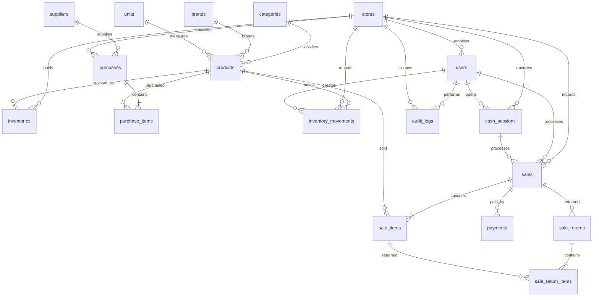

# Caseer Retail POS — Database Architecture

## Goals

Phase 1 establishes a production-oriented domain model for a retail POS that is:

- multi-store ready;
- auditable;
- safe for concurrent checkout and stock changes;
- suitable for purchasing, sales, returns, payments and cash sessions;
- extensible without putting business logic directly into controllers.

## Core design decisions

1. **Products are global master data.** A product can be sold by multiple stores.
2. **Inventory is store-specific.** `inventories` contains the current quantity for a product at a store.
3. **Inventory movements are the audit ledger.** Every stock-affecting operation creates an `inventory_movements` row. Current stock is cached in `inventories.quantity` for fast reads, while the movement ledger remains the source of audit history.
4. **Sales and purchases are immutable business documents after posting.** Corrections should use returns, adjustments or explicit reversal workflows rather than silently rewriting posted quantities.
5. **Checkout must run in a database transaction and lock the affected inventory rows.** This prevents two concurrent cashiers from overselling the same stock.
6. **Money uses fixed precision decimals.** Prices and totals use `decimal(15,2)` so the schema is safe if fractional pricing is needed later.
7. **Soft deletion is used for master data where historical references matter.** Transaction documents are not soft-deleted as a substitute for reversal.
8. **Store ownership is explicit.** Users, inventories, suppliers, purchases, sales and cash sessions can be scoped to a store.

## Domain map

## Main tables

| Area | Tables | Responsibility |
|---|---|---|
| Organization | `stores` | Store/branch identity and operational settings |
| Catalog | `categories`, `brands`, `units`, `products` | Product master data |
| Inventory | `inventories`, `inventory_movements` | Current stock + immutable stock ledger |
| Suppliers | `suppliers` | Supplier master data |
| Purchasing | `purchases`, `purchase_items` | Incoming stock documents |
| Sales | `sales`, `sale_items`, `payments` | POS transactions and tender records |
| Returns | `sale_returns`, `sale_return_items` | Customer return documents |
| Cash | `cash_sessions` | Cash drawer/session reconciliation |
| Audit | `audit_logs` | Security and business audit trail |

## Inventory invariants

- `inventories` has one row per `(store_id, product_id)`.
- `inventory_movements` is append-only from the application layer.
- A posted purchase increases inventory.
- A completed sale decreases inventory.
- A completed sale return increases inventory when the returned item is restockable.
- Manual adjustments require an explicit movement reason and actor.
- Negative stock should be rejected by default at checkout; an explicit future setting may allow it for selected stores/products.

## Transaction invariants

- `sales.invoice_number` is unique.
- `purchases.purchase_number` is unique.
- A sale must have at least one sale item before completion.
- Sale items preserve the unit price and discount actually charged, rather than reading current product prices later.
- Payments belong to a sale and preserve the actual tender amount and method.
- Returns reference the original sale item where possible.
- Financial totals are calculated from line snapshots and persisted on the document for reporting.

## Recommended application transaction for checkout

1. Start database transaction.
2. Validate cashier and open cash session.
3. Load the requested inventory rows with `FOR UPDATE` / Laravel `lockForUpdate()`.
4. Validate available quantities.
5. Create sale and sale items.
6. Create payment rows.
7. Decrease `inventories.quantity`.
8. Append `inventory_movements` rows with a `sale` reference.
9. Commit.

If any step fails, the whole checkout is rolled back.

## Future extensions

- product variants/barcodes;
- purchase returns;
- stock transfers between stores;
- customer/loyalty accounts;
- promotions and price lists;
- tax configuration;
- accounting integration;
- role/permission package integration;
- offline/PWA POS synchronization.
